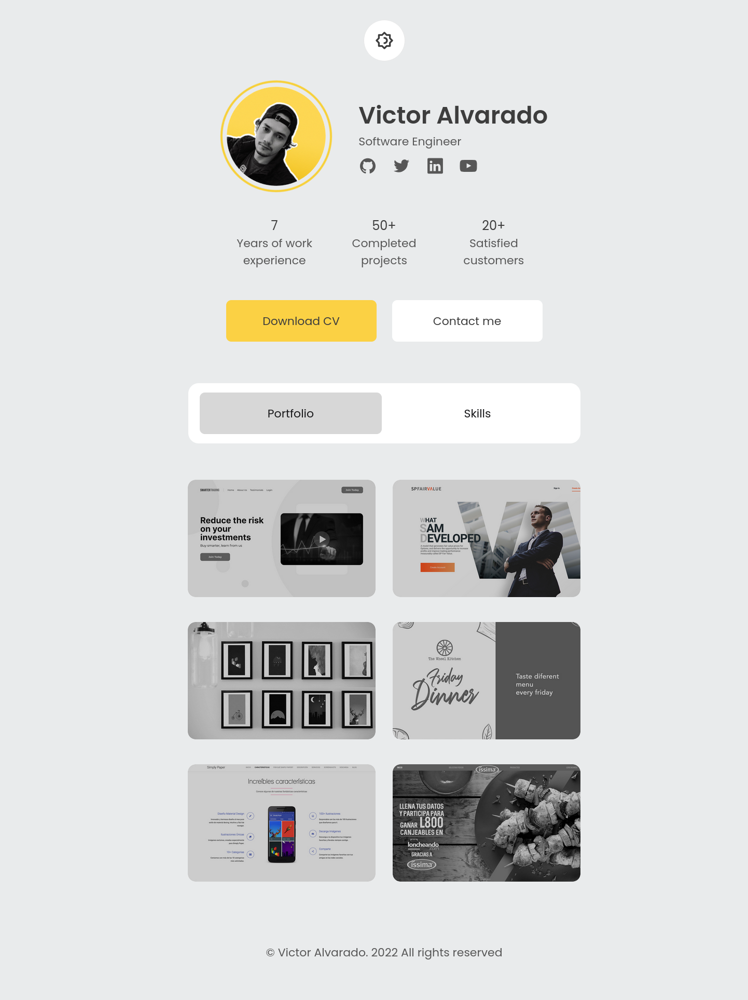
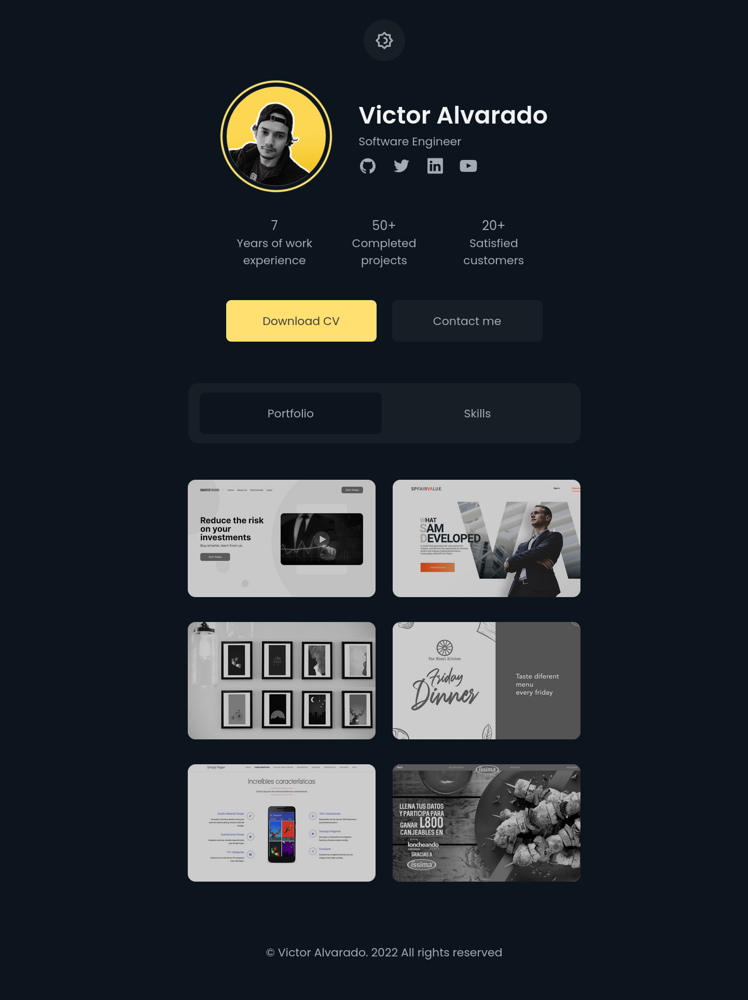
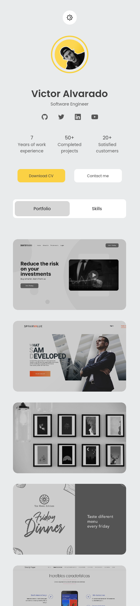
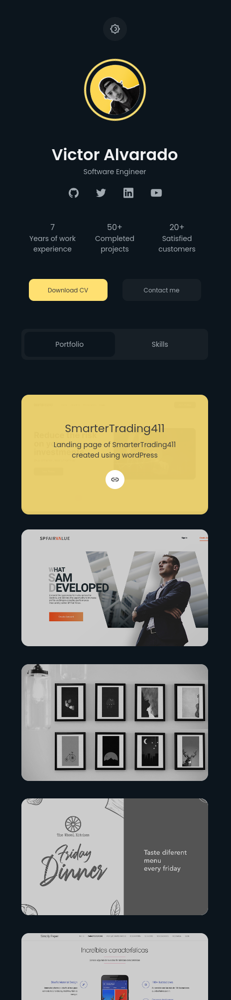

# portfolio-template

This is a homework project for the **Solvd.Laba React.js Development Course**. The task was to implement a portfolio template based on a provided design.

The main goals were:
- Recreating the provided design using **HTML**, **CSS (BEM)**, and **JavaScript**.
- Implementing **light and dark mode**.
- Ensuring the layout is **responsive** on both desktop and mobile screens.

---

## 📸 Screenshots

> Note: Screenshots were captured from the browser preview and may appear slightly compressed in this format.

### 💻 Desktop View

Light Mode  


Dark Mode  


### 📱 Mobile View

Light Mode  


Dark Mode  


---

## 🚀 Getting Started

1. Clone the repository:
    ```bash
    git clone https://github.com/your-username/portfolio-template.git
    ```
2. Open index.html in your browser — no installation required.